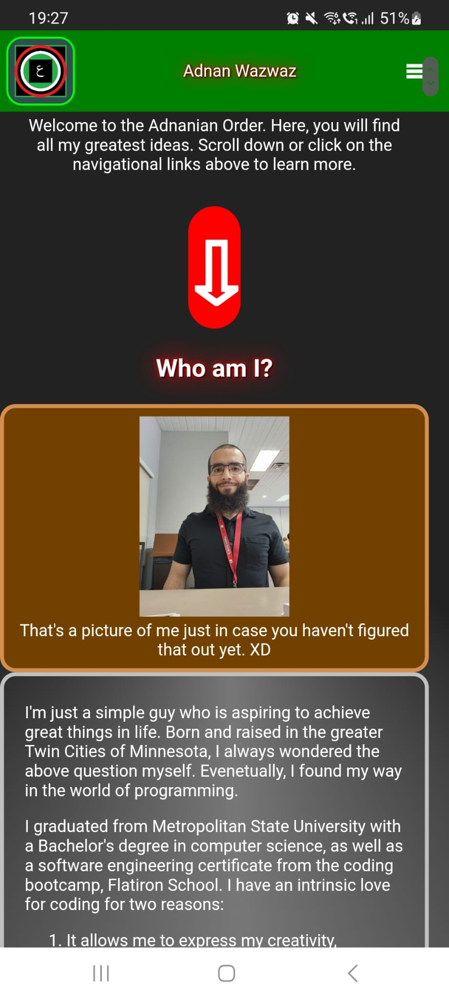
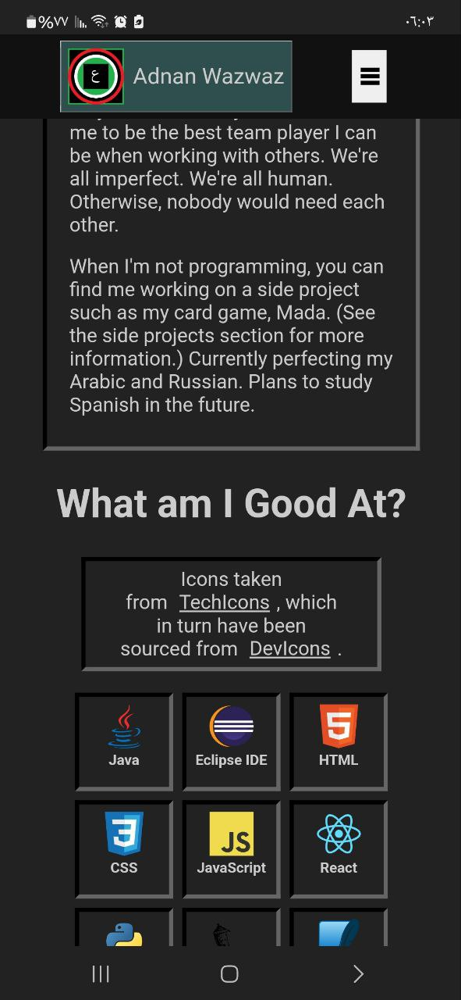

# Adnanian Order - The Portfolio of Adnan Wazwaz

|                                          |                                        |
|------------------------------------------|----------------------------------------|
|                  Author                  |              Adnan Wazwaz              |
|                  Version                 |                  2.2.1                 |
|               Original Date              |              2024 July 31              |
|           Current Version Date           |             2026 January 30            |
|             Adnanian App No.             |                   18A                  |
| [**Demo**](https://youtu.be/bcAnHT04wJM) | [**Live**](https://adnanianorder.com/) |

## Table of Contents

1. [Overview](#overview)
    1. [What This Application Does](#what-this-application-does)
    2. [Why This Application was Created](#why-this-application-was-created)
    3. [Technologies](#technologies)
    4. [Limitations](#limitations)
2. [Changes](#changes)
    1. [Original Wireframe](#original-wireframe)
    2. [Before Proper Styling](#before-proper-styling)
    3. [After Proper Styling](#after-proper-styling)
    4. [Other Changes](#other-changes)
3. [Future Plans](#future-plans)
4. [Credits](#credits)

## Overview

### What This Application Does

This is simply my personal website. I talk about my professional background and
showcase all my technical works and side projects.

### Why This Application Was Created

This website also serves as my portfolio. I showcase my works and link my other
social media, such as LinkedIn and YouTube. If somebody wants to get to know me
on a simple level, they can find this website here.

Not everyone uses LinkedIn, and I can't put everything on my resumé. So it's
always nice to have everything on a portfolio.

### Technologies

This application consists of three repositories on GitHub: the client (this repo),
the server, and the admin. The client is the only repo that I have made public.

The client is a frontend web application built using HTML, CSS, and JavaScript
with the React library, and deployed on Render. The contact form is powered by
Formspree CLI, which allows users to send messages to my email without needing
a backend.

The client retrieves the project and skill data from the server to have them
rendered on the components.

### Limitations

There is a lingering issue with iframe element of the video. On mobile phones,
the video takes up too much width. Even if I set the width to a percentage, it
doesn't have any effect. The weird thing is that on DevTools, the iframe is
resized the way I want to, even when I'm viewing it as a mobile phone.

## Changes

The most significant change in this application was the CSS. The following changes
were made in regards to the styling:

- I reduced my color scheme, so that not only am I using only two to three colors
with different shades, but using colors that are compatible with one another.

- I stopped using gradient effects for the background. I opted to use solid colors
instead.

- For dark mode, I have the whole page as a black with white text. I added a light
mode media query which displays the negatives of those colors.

- I stopped using any glow text.

- I removed the borders of all links. Although, some still have borders when they
are hovered.

- Ensured to align elements properly.

- When re-styling, I ensured to style my elements for mobile devices first before
doing them for desktop.

With those significant improvements in the styling, my website looks much cleaner.

### Details from Previous Versions

#### Version 2.1.1

- Included more skills in the skills section:
  - Ubuntu
  - Bash
  - Vite.js
  - Visual Studio Code
  - Android
  - Windows 11
  - GitHub
  - Markdown

- Corrected typos and grammatical mistakes.

#### Version 2.1.2

- Included more skills in the skills section:
  - TypeScript (after completing two TypeScript LinkedIn courses, and I plan to complete more).
  - Microsoft SQL Server
  - Oracle
  - Apple
  - Linux
  - Raspberry Pi
  - Apple Safari
  - Chrome
  - Google
  - Internet Explorer 10 (although nobody uses it anymore).
  - LinkedIn

- Moved the most releveant skills of the tech stack to the top of the skills
section.

#### Version 2.2.0

- Created a whole new repository and am retiring the previous ones. This is due
to the previous ones having security issues. The new repository was created with
Vite.js. The older repositories were created with CreateReactApp, which is now
deprecated.

  - [Click here to view the old repo.](https://github.com/adnanian/adnanian-portfolio)

- Previously, I deployed the client on Netlify and the server on Vercel. Now
all repositories for this project are deployed on Render, including the database.
Render makes it easy to organize related repositories into a single project.

- Moved all code pertaining to management of skill and project data from the
client repository to the new admin repository, so that the client repo is focused
solely on data retrieval and display. Now I don't have to hardcode my
projects anymore.

  - The backend repo was created with Python, Flask, and PostgreSQL.

  - The admin repo is another React/Vite.js frontend web app that requires
  authorization to use.

- Ensured that the only skills in the skill sections are those that I'm either
a master of, or have a solid foundation. I no longer add skills of tools, languages,
or other things that I simply dabbled in at one point, as those don't really
count.

#### Version 2.2.1

- Separated the skill React / React Native into two different skills, as they
are different frameworks. Added the React Native icon from Icons8.

- Added React Native credits in the Skills sections.

### Original Wireframe

### Before Proper Styling

### After Proper Styling

### Other Changes

In terms of JSX content, I combined the technical projects and side projects
section into one section. In this version, the user can toggle between radio
buttons to view project types. Less scrolling makes it easier.

## Future Plans

I plan to improve the application by doing the following:

- Use a CSS framework like React Bootstrap or Material UI to make styling
easier, and compatible for all platforms and screen sizes.

- Add animations for whenever I hover to or click on a component.

- Add more side projects and convert the slideshow into a slide of side projects
and not just for Mada.

- Add more technical projects.

- Maybe sort each group of skills in alphabetical order.

- Translate this website into Arabic.

## Credits

MIT License

Copyright (c) 2025 Adnan Wazwaz

Permission is hereby granted, free of charge, to any person obtaining a copy
of this software and associated documentation files (the "Software"), to deal
in the Software without restriction, including without limitation the rights
to use, copy, modify, merge, publish, distribute, sublicense, and/or sell
copies of the Software, and to permit persons to whom the Software is
furnished to do so, subject to the following conditions:

The above copyright notice and this permission notice shall be included in all
copies or substantial portions of the Software.

THE SOFTWARE IS PROVIDED "AS IS", WITHOUT WARRANTY OF ANY KIND, EXPRESS OR
IMPLIED, INCLUDING BUT NOT LIMITED TO THE WARRANTIES OF MERCHANTABILITY,
FITNESS FOR A PARTICULAR PURPOSE AND NONINFRINGEMENT. IN NO EVENT SHALL THE
AUTHORS OR COPYRIGHT HOLDERS BE LIABLE FOR ANY CLAIM, DAMAGES OR OTHER
LIABILITY, WHETHER IN AN ACTION OF CONTRACT, TORT OR OTHERWISE, ARISING FROM,
OUT OF OR IN CONNECTION WITH THE SOFTWARE OR THE USE OR OTHER DEALINGS IN THE
SOFTWARE.

Shoutout to [Kyra Hamerling-Potts](https://www.linkedin.com/in/kyra-hamerling-potts/)
and [Anna Cole](https://www.linkedin.com/in/anna--cole/) for offering CSS feedback and suggestions.

Special shoutout to [Danesh Madarbakus](https://www.linkedin.com/in/daneshmadarbakus/) for
his honest feedback and his knowledge on portfolios. He has shown me examples of how
most modern websites are styled now adays. I took his feedback to heart and applied all these
styling changes that you see in version 2.0 due to them. Thanks, bro.

**2.2.0** - another special shoutout to [Saif Alkayali](https://www.linkedin.com/in/saif-alkayali/)
for introducing me to GitHub Copilot and spending time showing me how to use
it. I found it very handy to be able to solve and debug my code without having
to continuously copy and paste into ChatGPT and removing certain words to
protect my privacy. This helped me alot. I especially loved the code completions
and the comments that they help me generate and complete, as sometimes that
could be difficult. Thanks, bro.
